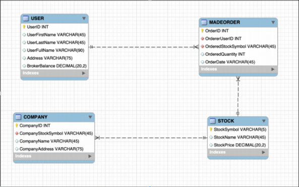
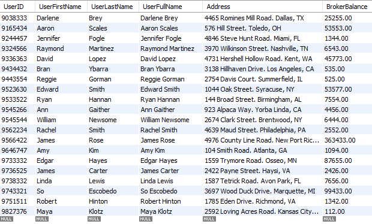
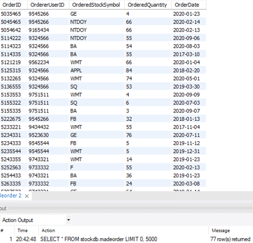

# Stock Database
Created by: Yesenia Galindo, Saad Khan, Arjaey Bautista

We built a stock database where users can purchase any stock of their choice, as long as they have the available balance for it. The user can view the stock prices for each company and decide what company to invest in. The user can also search for a certain price range per stock that best fits their budget. 

The Database stores the user's purchases and the user can keep track of how much money they've invested as well as the current prices of owned stocks. The database also stores the date of purchase so that the user can view all seperate purchases. 

## Business Rules
* A user must provide full name, address, and balance for their profile. 
* A user must have an available balance in order to purchase stocks. 
* A stock must have a symbol that represents its company. 
* A stock cannot exist without its respective company. 
* A stock must have a price so that a user can make a purchase. 
* An order date is stored to keep track of when purchases are made.
* An order cannot exist without a user making a purchase. 
* An order must consist of the quantity of stocks a user wants to purchase.

## Entities
USER: UserID (Primary Key), UserFirstName, UserLastName, UserFullName, Address, BrokerBalance

MADEORDER: OrderID (Primary Key), OrderUserID, OrderedStockSymbol, OrderedQuantity, OrderedDate

STOCK: StockSymbol (Primary Key), StockName, StockPrice

COMPANY: CompanyID (Primary Key), CompanyStockSymbol, CompanyName, CompanyAddress

## Entity Relationships
* USER has a one-to-many (1:M) relationship with MADEORDER because a user is able to make multiple orders. An order can only belong to one user and it's not possible to have an order without a user. 
* STOCK has a one-to-many (1:M) relationship with MADEORDER because there can be many orders for a stock type, but there can only be one stock type for each order.
* STOCK has a one-to-many (1:M) relationship with COMPANY because a certain stock belongs to one company. A stock cannot exist without a company. 

## ER Diagram

## Data Tables
### User

### Order

### Stock

### Company

## User Portfolio Search GUI
* Created using JavaFX, Scene Builder, and MySQL Connector/J.
* User enters the full name of a person that has a stock portfolio.
* After clicking the search button, the person's stock information is displayed.
* If user enters a name that is not in the USER database, then the message "No content in table" appears on the screen. 

